<div align="center">

<h1>
  
  &nbsp;Bestie
</h1>

### Watch the World Cup with Bestie

A mobile-first web app that helps first-time World Cup viewers enjoy every match
without feeling confused or left out. Tap what just happened — Bestie reacts and
explains it, like watching with your funniest friend.

[](https://bestie-world-cup-ai.vercel.app/)


<br/>



</div>

---

## 🎥 Try it

**Live app → [bestie-world-cup-ai.vercel.app](https://bestie-world-cup-ai.vercel.app/)**

Open it on a phone (or a phone-sized browser window), pick a match, choose a
personality, and tap a moment like **Goal** or **Red Card** to see Bestie react.

## 📸 Screenshots

The animated mascot above ([`assets/bestie-hero.svg`](assets/bestie-hero.svg)) is a
real, self-contained SVG — it breathes, blinks, and flaps right here in the README.

Real screen captures go in [`/screenshots`](screenshots). Once added, they render below:

| Landing | Companion | Goal celebration |
| :---: | :---: | :---: |
| _`screenshots/landing.png`_ | _`screenshots/companion.png`_ | _`screenshots/goal.png`_ |

<details>
<summary>How to add the real screenshots</summary>

1. Open the [live app](https://bestie-world-cup-ai.vercel.app/) in a phone-sized window (or on your phone).
2. Capture the three screens and save them as `landing.png`, `companion.png`, and `goal.png` in `/screenshots`.
3. Replace the placeholder table cells with, e.g., ``.

_Tip: a short screen recording of tapping **Goal** makes a great demo GIF — drop it in [`/demo`](demo) and embed it here._

</details>

## The Problem

The World Cup is the biggest shared event on the planet — but for casual viewers
like **Emily**, watching can feel alienating. She's on the couch with friends,
family, or a partner who *get* soccer, and she doesn't. Something happens on
screen, everyone reacts, and she's left thinking *"wait… what just happened?"* —
but doesn't want to ask and feel embarrassed.

Existing options don't help: broadcast and stats apps assume you already
understand the game, education content feels like homework, and betting apps are
a different universe. Nothing is built to simply sit beside her and help her
enjoy the moment.

## The Solution

**Bestie is an AI companion, not a teacher.** It feels like a warm, funny best
friend on the couch. When something happens — a goal, a red card, a VAR review —
you tap it, and Bestie reacts in character and explains it in a friendly
sentence, never lecturing, never overwhelming.

> **Never teach. Always help. Never lecture. Always encourage. Never overwhelm. Always simplify.**

## ✨ Features

- **Tap-to-explain loop** — tap any of 8 moments (Goal, Yellow/Red Card, Offside,
  Corner Kick, Penalty, VAR, "What Should I Say?") and get a short, warm answer.
- **AI explanations** — powered by OpenAI `gpt-4o-mini`; ≤35 words, beginner-first,
  emotionally live but honest (no invented scores).
- **5 personality modes** — Cute, Funny, Hype, Coach, Beginner — each changes both
  Bestie's *voice* and her *look*; your choice is saved locally.
- **A living mascot** — Bestie breathes, blinks, tilts, and reacts: jumps + confetti
  on a goal, gasps on a red card, thinks during VAR, and more.
- **World Cup atmosphere** — stadium backdrop, a live-style scoreboard, a full-screen
  goal celebration, and playful football tiles.
- **Disney-style dialogue** — replies appear in a speech bubble that types out.
- **Delightful & fast** — Framer Motion throughout, ~60 FPS (transform/opacity only),
  mobile-first, and reduced-motion friendly.

**Intentionally not in scope:** accounts, payments, a database, real-time event
detection, or live sports data. Built for delight and fast delivery — see the
[PRD](docs/01_PRD) for the full scope.

## 🛠 Tech Stack

| Area | Choice |
| ---- | ------ |
| Framework | Next.js 14 (App Router) |
| Language | React 18 + TypeScript (strict) |
| Styling | Tailwind CSS (pastel design system) |
| Animation | Framer Motion |
| AI | OpenAI API (`gpt-4o-mini`) via one server route |
| Memory | Browser `localStorage` (personality preference) |
| Hosting | Vercel |

## 🚀 Getting Started

**Prerequisites:** Node.js 18+ and an OpenAI API key with available credit.

```bash
cd frontend
npm install
cp .env.example .env.local     # then add your key:  OPENAI_API_KEY=sk-...
npm run dev
```

Open <http://localhost:3000> in a phone-sized viewport. To test on your phone
over the local network: `npm run dev -- -H 0.0.0.0` and visit
`http://<your-computer-ip>:3000`.

> `.env.local` is git-ignored — your API key is never committed and is only used
> server-side (never exposed to the browser).

## ☁️ Deploy your own

[](https://vercel.com/new/clone?repository-url=https://github.com/haniadham2/bestie-world-cup-ai&root-directory=frontend&env=OPENAI_API_KEY&envDescription=OpenAI%20API%20key%20used%20server-side%20for%20Bestie%27s%20replies)

Set the project **root directory to `frontend`** and add the `OPENAI_API_KEY`
environment variable.

## 📁 Repository Structure

```
world-cup-bestie-ai/
├── frontend/              # The Next.js app — see frontend/README.md
│   ├── app/              # Routes: landing, matches, companion, /api/bestie
│   ├── components/       # Bestie mascot, SpeechBubble, Scoreboard, tiles, …
│   ├── hooks/ lib/ services/ types/
├── docs/                  # Product & engineering docs (filled in)
│   ├── 01_PRD/            04_Product_Strategy/   07_Prompt_Engineering/   10_Launch/
│   ├── 02_User_Research/  05_AI_Strategy/        08_AI_Evaluation/
│   ├── 03_Competitive_…/  06_System_Architecture/ 09_Roadmap/
├── prompts/ evaluations/ assets/ screenshots/ demo/ decision_logs/
├── README.md · LICENSE · .gitignore
```

## 📚 Documentation

A full product/engineering doc set lives in [`docs/`](docs):

- **[Product Requirements (PRD)](docs/01_PRD)** — the definitive spec.
- **[System Architecture](docs/06_System_Architecture)** · **[AI Strategy](docs/05_AI_Strategy)** · **[Prompt Engineering](docs/07_Prompt_Engineering)**
- **[Roadmap](docs/09_Roadmap)** · **[Launch](docs/10_Launch)**

## 🗺 Status & Roadmap

**✅ Live** — landing, match selection, and companion screens; OpenAI-powered
explanations; 5 personalities; animated mascot; goal celebration; deployed on
Vercel.

**🔮 Next** — a more match-reactive voice, first-tap onboarding, and a shareable
"Bestie reaction" card.

**🔮 Later** — real fixtures via a Sports Data API; a backend (FastAPI) with
caching (Redis) and a database (PostgreSQL); live event detection; analytics.

See [`docs/09_Roadmap`](docs/09_Roadmap) for detail.

## 📄 License

Released under the [MIT License](LICENSE).
